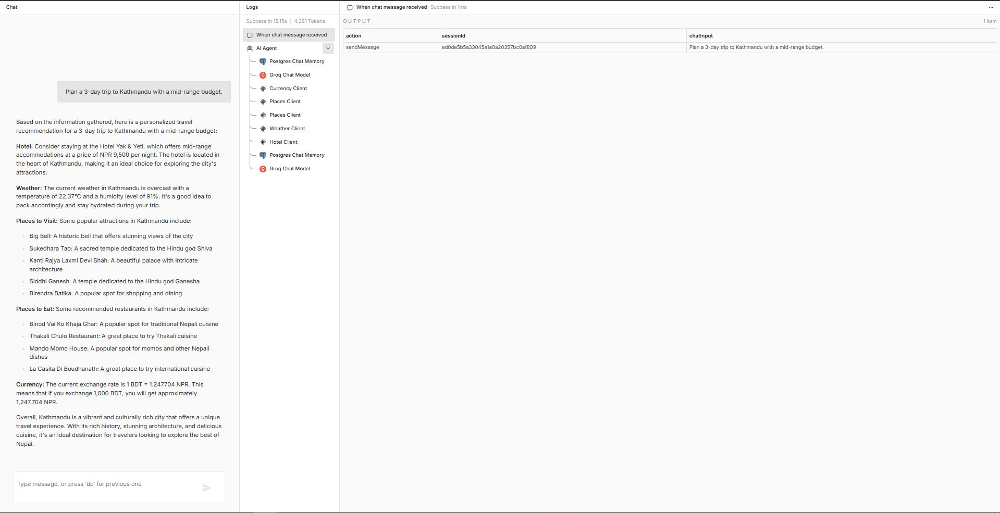
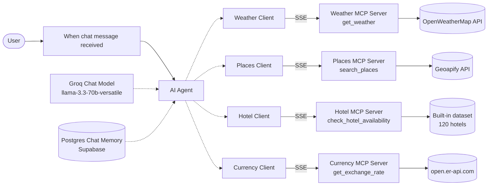
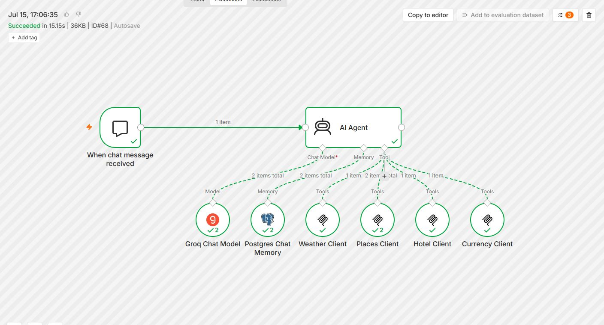

# AI Travel Assistant with MCP Servers in n8n

A chat-based travel assistant built in n8n. You ask it something like "Plan a 3-day trip to Kathmandu with a mid-range budget", and an AI agent pulls live weather, nearby attractions and restaurants, hotel options for your budget, and the current exchange rate, then writes one travel plan from all of it.

Each data source is its own MCP (Model Context Protocol) server, built as a separate n8n workflow. The agent connects to all four as a client and decides on its own which ones a question needs.



## Contents

1. [Why MCP](#why-mcp)
2. [Architecture](#architecture)
3. [Repository layout](#repository-layout)
4. [The agent workflow](#the-agent-workflow)
5. [The four MCP servers](#the-four-mcp-servers)
6. [Example run](#example-run)
7. [Setup](#setup)
8. [Challenges and how they were solved](#challenges-and-how-they-were-solved)
9. [Known limitations](#known-limitations)
10. [Ideas for next steps](#ideas-for-next-steps)

## Why MCP

A language model only knows what was in its training data. Ask it about today's weather in Sylhet or the BDT to THB rate and it will either refuse or guess, and for trip planning a confident guess is worse than no answer.

MCP gives the model a standard way to call outside tools while it's answering. Each tool describes itself (name, what it does, what inputs it takes), the model picks the ones it needs, and the results come back as data it can quote. Here that means the weather in the answer is the weather the OpenWeatherMap API returned a few seconds ago, and the restaurant names come from Geoapify, not from the model's memory.

Splitting the tools into separate MCP servers also keeps things tidy. Each server is a two-node workflow that can be tested, activated, and fixed on its own, and any MCP-compatible client (not only this agent) can connect to it.

## Architecture



There are five workflows in total:

| Workflow | Role | Nodes |
| --- | --- | --- |
| Travel Assistant | The MCP client: chat, agent, model, memory, four MCP Client Tool nodes | 8 |
| Weather MCP Server | Exposes `get_weather` | 2 |
| Places MCP Server | Exposes `search_places` | 2 |
| Hotel MCP Server | Exposes `check_hotel_availability` | 2 |
| Currency MCP Server | Exposes `get_exchange_rate` | 2 |



## Repository layout

```
.
├── README.md
├── workflows/
│   ├── travel-assistant-agent.json      # main chat agent (MCP client)
│   └── mcp-servers/
│       ├── weather-mcp-server.json      # get_weather
│       ├── places-mcp-server.json       # search_places
│       ├── hotel-mcp-server.json        # check_hotel_availability
│       └── currency-mcp-server.json     # get_exchange_rate
├── docs/
│   └── hotel-dataset.md                 # all 120 hotels in the mock dataset
└── screenshots/
    ├── chat-input-output.jpg            # a full conversation in the n8n chat
    └── agent-execution.jpg              # the execution view after a successful run
```

API keys, credential IDs, and my n8n instance address have been replaced with placeholders in every JSON file. See [Setup](#setup) for where to put your own.

## The agent workflow

File: [`workflows/travel-assistant-agent.json`](workflows/travel-assistant-agent.json)

### When chat message received

n8n's Chat Trigger. It gives the workflow a chat window (inside the editor, and as a hosted page because **Public** is on) and greets the user with:

> Hi there! 👋 My name is Mihad. How can I assist you today?

Every message goes to the agent as `chatInput`, along with a `sessionId` that identifies the conversation.

### AI Agent

The Tools Agent node. It takes the user's message, sends it to the model along with the descriptions of all connected tools, runs whatever tool calls the model asks for, and repeats until the model has a final answer.

Most of the behaviour comes from the prompt. It tells the agent to always fetch real data before answering and never to fall back on its own knowledge for weather, places, hotels, or currency. Then it gives one rule per tool:

| Tool | When the prompt says to call it |
| --- | --- |
| `get_weather` | Whenever weather matters, with the location name |
| `search_places` | For attractions or restaurants, once per category |
| `check_hotel_availability` | For hotels, with the budget tier if known, or without one to see every option |
| `get_exchange_rate` | Only for international trips, from the user's home currency (BDT unless they say otherwise) to the local one |

On top of that, the prompt asks the agent to plan around the actual weather (no outdoor hiking if rain is coming), to recommend hotels that match the user's budget, to name the specific places the tools returned, and to recall preferences the user shared earlier instead of asking again.

### Groq Chat Model

`llama-3.3-70b-versatile` hosted on Groq. Speed matters here, because one question can lead to five or six tool calls before the final answer, and every one of them is another round trip to the model.

### Postgres Chat Memory

Stores the conversation in a Postgres database hosted on Supabase, with a context window of 10, so the agent sees the last 10 exchanges of the session. That's how it can remember "I'm on a tight budget" from earlier in the chat and apply it to the next destination without being told again.

### Weather, Places, Hotel, and Currency Clients

Four MCP Client Tool nodes, one per server. Each points at the production URL of an MCP Server Trigger (`https://<your-instance>.app.n8n.cloud/mcp/<path>`) and uses SSE as the transport. When the agent starts, each client asks its server which tools it has, and those tools show up to the model as if they were native.

## The four MCP servers

Every server has the same shape: an **MCP Server Trigger** that publishes an endpoint, and one **Code Tool** node attached to it as the tool. Each Code Tool has a manually defined JSON input schema. That turned out to matter a lot (see [Challenges](#challenges-and-how-they-were-solved)).

The tools return JSON strings on success. When something goes wrong (missing input, unknown place, unsupported currency), they return a short plain-text message in Bangla instead, which the agent then passes on in its own words.

### 1. Weather MCP Server: `get_weather`

File: [`workflows/mcp-servers/weather-mcp-server.json`](workflows/mcp-servers/weather-mcp-server.json)

Input:

| Field | Required | Example |
| --- | --- | --- |
| `location` | yes | `Cox's Bazar` |

It makes two calls to OpenWeatherMap. The Geocoding API turns the place name into latitude and longitude, then the Current Weather API returns conditions for that point in metric units. The tool keeps only what a traveller cares about:

```json
{
  "location": "Kathmandu",
  "temperature": "°C",
  "feels_like": "°C",
  "description": "text from OpenWeatherMap, e.g. overcast clouds",
  "humidity": "%",
  "wind_speed": "m/s"
}
```

### 2. Places MCP Server: `search_places`

File: [`workflows/mcp-servers/places-mcp-server.json`](workflows/mcp-servers/places-mcp-server.json)

Input:

| Field | Required | Values |
| --- | --- | --- |
| `location` | yes | Any city or place name |
| `category` | yes | `attractions` or `restaurants` |

Also two API calls, both to Geoapify:

1. Geocoding search to get coordinates for the location.
2. Places search within a 5 km circle around those coordinates, limited to 10 results.

The category is mapped to a Geoapify category code: `attractions` becomes `tourism.sights` and `restaurants` becomes `catering.restaurant`. Anything else falls back to `tourism.sights`. Each result is cut down to a name, a formatted address, and the first category.

This is why the agent calls the Places Client twice for a full trip plan: once for sights, once for food.

### 3. Hotel MCP Server: `check_hotel_availability`

File: [`workflows/mcp-servers/hotel-mcp-server.json`](workflows/mcp-servers/hotel-mcp-server.json)

Input:

| Field | Required | Values |
| --- | --- | --- |
| `location` | yes | City or place name |
| `budget` | no | `budget`, `mid-range`, or `luxury` |

There's no free, reliable hotel booking API, so this tool searches a dataset written into the node: 40 destinations, three hotels each, 120 in all. Twenty destinations are in Bangladesh (Cox's Bazar, Sajek Valley, Bandarban, Sylhet, Sreemangal, Saint Martin's Island and more) and twenty are abroad (Kathmandu, Bangkok, Bali, Dubai, Istanbul, Tokyo and others). Prices are in each destination's local currency.

Location matching is loose on purpose: the tool lowercases both sides and keeps a hotel if either name contains the other. The budget filter, when given, is an exact match on the tier.

The full list is in [`docs/hotel-dataset.md`](docs/hotel-dataset.md).

### 4. Currency MCP Server: `get_exchange_rate`

File: [`workflows/mcp-servers/currency-mcp-server.json`](workflows/mcp-servers/currency-mcp-server.json)

Input:

| Field | Required | Example |
| --- | --- | --- |
| `from_currency` | yes | `BDT` |
| `to_currency` | yes | `NPR` |

Calls `https://open.er-api.com/v6/latest/{from}`, a free endpoint that needs no API key, and picks out the target rate:

```json
{
  "from": "BDT",
  "to": "NPR",
  "rate": 1.247704,
  "last_updated": "..."
}
```

Codes are uppercased first, so `usd` works as well as `USD`.

## Example run

Prompt:

> Plan a 3-day trip to Kathmandu with a mid-range budget.

The run took 15.15 seconds and 4,361 tokens. In the execution log the agent made these tool calls:

| Order | Node | What it was for |
| --- | --- | --- |
| 1 | Currency Client | BDT to NPR, since Kathmandu is abroad |
| 2 | Places Client | Attractions |
| 3 | Places Client | Restaurants |
| 4 | Weather Client | Current weather in Kathmandu |
| 5 | Hotel Client | Mid-range hotels in Kathmandu |

Postgres Chat Memory and the Groq model each ran twice, once before the tool calls and once to write the final answer.

What came back:

- Hotel: Hotel Yak & Yeti at NPR 9,500, the mid-range entry for Kathmandu in the dataset.
- Weather: overcast, 22.37°C, 91% humidity.
- Attractions: Big Bell, Sukedhara Tap, Kanti Rajya Laxmi Devi Shah, Siddhi Ganesh, Birendra Batika.
- Restaurants: Binod Vai Ko Khaja Ghar, Thakali Chulo Restaurant, Mando Momo House, La Casita Di Boudhanath.
- Currency: 1 BDT = 1.247704 NPR, so 1,000 BDT is about 1,247.70 NPR.

The places and restaurants are real Geoapify results. The one-line descriptions next to them ("a sacred temple dedicated to the Hindu god Shiva") were written by the model, because `search_places` only returns names and addresses.

## Setup

### What you need

| Service | Used for | Cost |
| --- | --- | --- |
| n8n (Cloud or self-hosted, with the LangChain nodes) | Running all five workflows | Free trial or self-hosted |
| [OpenWeatherMap](https://openweathermap.org/api) | Weather server | Free tier |
| [Geoapify](https://www.geoapify.com/) | Places server | Free tier |
| [open.er-api.com](https://www.exchangerate-api.com/docs/free) | Currency server | Free, no key |
| [Groq](https://console.groq.com/) | The LLM | Free tier |
| Postgres, e.g. [Supabase](https://supabase.com/) | Chat memory | Free tier |

### 1. Import and activate the four MCP servers

For each file in `workflows/mcp-servers/`:

1. In n8n, create a new workflow and use **Import from File**.
2. For Weather, open the `get_weather` node and replace `YOUR_OPENWEATHERMAP_API_KEY` with your key.
3. For Places, open the `search_places` node and replace `YOUR_GEOAPIFY_API_KEY` with your key.
4. Hotel and Currency need no keys.
5. Save and switch the workflow to **Active**.
6. Open the MCP Server Trigger node and copy its **Production URL**.

A new OpenWeatherMap key can take an hour or two to start working, so don't panic if the first calls return 401.

### 2. Import the agent

1. Import `workflows/travel-assistant-agent.json`.
2. Paste each production URL from step 1 into the matching client node (Weather Client, Places Client, Hotel Client, Currency Client). The file has `https://YOUR-N8N-INSTANCE.app.n8n.cloud/mcp/...` as a placeholder.
3. **Groq Chat Model**: create a Groq credential with your API key.
4. **Postgres Chat Memory**: create a Postgres credential. For Supabase, use the connection details from Project Settings → Database. The node creates its chat history table on first run.

### 3. Chat

Click **Open chat** in the editor and try things like:

- `Plan a 3-day trip to Kathmandu with a mid-range budget.`
- `What's the weather in Sylhet right now, and where should I eat?`
- `I'm on a tight budget. Suggest a hotel in Cox's Bazar.`
- `How much is 10,000 BDT in Thai baht? I'm going to Bangkok.`

## Challenges and how they were solved

**Input formats that didn't match between tools.** n8n's Code Tool node was the source of repeated mismatches between what the model sent and what the code expected. Giving every tool a consistent JSON input schema with named fields fixed it. The model now calls all four tools the same way, and the code can read `query.location` directly.

**No free hotel API.** There was no free, reliable hotel booking API to use, so I built a realistic mock dataset instead: 120 hotels across 40 destinations, three price tiers each. Swapping it for a real API later only means changing one Code Tool.

**Remembering the user.** I added Postgres Chat Memory, hosted on Supabase, so the agent keeps preferences like budget and activity type and applies them to later questions.

## Known limitations

- API keys sit in plain text inside the Code Tool nodes. They're placeholders in this repo, but in a live instance anyone who can open the workflow can read them.
- The MCP Server Triggers have no authentication, so anyone with the URL can call the tools (and use up the API quotas). The trigger supports Bearer and header auth, and turning it on is a good idea before sharing anything.
- The chat is set to Public, so the hosted chat page is reachable by anyone who has its link.
- Weather is current conditions only. For a three-day plan, a forecast endpoint would be more useful.
- Hotel data is fictional in places and fixed in time. Prices don't change and every hotel is always "available".
- The budget filter is an exact match. If the model sends `mid range` or `moderate` instead of `mid-range`, it gets no results.
- Error messages from the tools are in Bangla while the agent answers in English. The agent translates them, but it can look odd in the logs.
- Memory is keyed on the chat's session ID, so a brand-new chat session starts without the preferences from an old one.

## Ideas for next steps

- Add a `get_forecast` tool using OpenWeatherMap's 5-day forecast.
- Move the API keys into n8n credentials and call the APIs with HTTP Request Tool nodes instead of raw code.
- Turn on Bearer auth for all four MCP servers.
- Connect the same MCP servers to a different MCP client, such as a desktop AI app, to show they work outside n8n.
- Replace the hotel dataset with a real API once a usable free one turns up.

## Author

Romith
GitHub: [@ismam-tasnime](https://github.com/ismam-tasnime)
